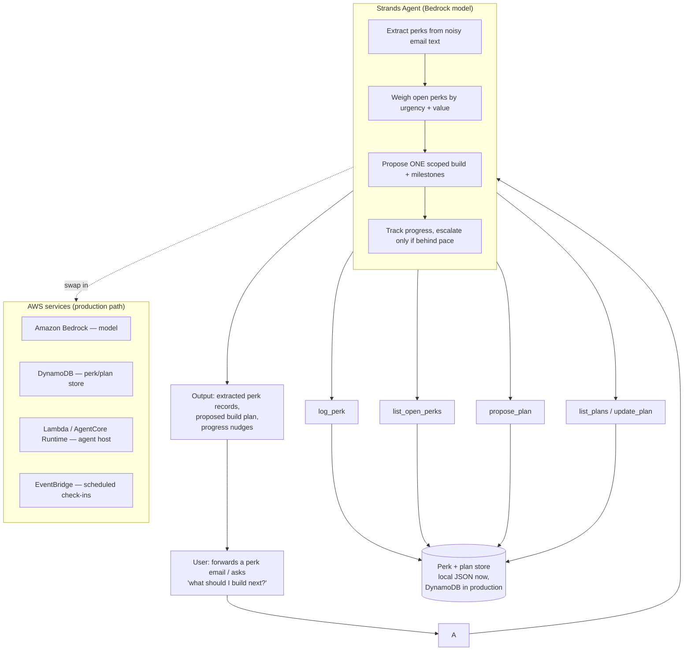

# Architecture

## Components

| Layer | Now (hackathon demo) | Production path |
|---|---|---|
| Interface | CLI (`demo.py`) feeding sample emails | Web/chat form or email-forward address |
| Agent core | Strands `Agent` with a system prompt encoding the extract → prioritize → propose → track loop | Same, deployed via AgentCore Runtime |
| Model | Amazon Bedrock (Claude) | Same |
| Tools | `log_perk`, `list_open_perks`, `propose_plan`, `list_plans`, `update_plan` | Same tools, same signatures |
| Store | Local JSON file (`data/store.json`) | DynamoDB table, same read/write shape |
| Scheduling | Manual re-invocation | EventBridge-triggered check-ins |

## Why this loop is agentic, not a lookup

The reasoning steps that matter — deciding which perk is urgent enough to
act on, scoping a build that plausibly fits the remaining time/budget, and
deciding whether progress is "on pace" or needs to surface to the user —
are judgment calls, not deterministic lookups. A cloud credit dashboard
can tell you a balance and a date; it can't tell you what to build with it
or whether you're falling behind.
